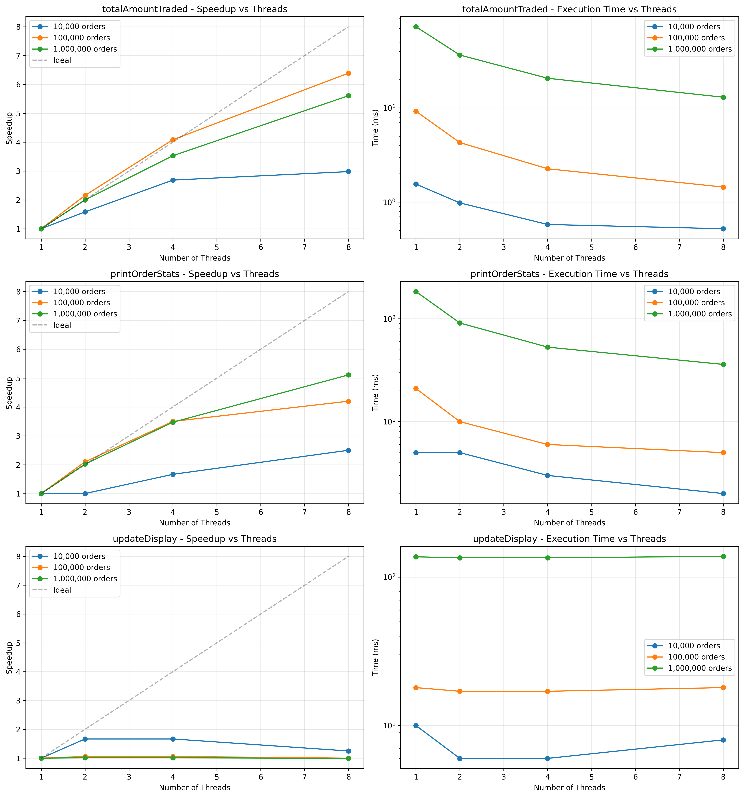

### Usage directions

1. Replace `functions.h` and `functions.cpp` with your implemented versions.
2. `make all` generates an executable `testgen`, run it with the command line args `./testgen <frequency> <size>`.
3. To look at the actual testcase in a readable form, you can uncomment line 122 in `tests.cpp`.


## Benchmark Results

### Performance Summary

Tests conducted on **Apple M4, 10 cores** with varying workload sizes:

| Function | 10K Orders | 100K Orders | 1M Orders | Speedup @ 8 threads |
|----------|-----------|-------------|-----------|---------------------|
| **totalAmountTraded()** | - | - | - | **5.61x** |
| **printOrderStats()** | - | - | - | **5.11x** |
| **updateDisplay()** | - | - | - | **0.99x** |



*Speedup vs. number of threads for the three parallel functions. Dashed line represents ideal linear speedup.*

### Running Benchmarks

```bash
# Run the benchmark
./testgen 1000 1000000

# The program outputs:
# - Sequential execution time
# - Parallel execution time
# - Speedup metrics
```

### Generating Performance Graphs

```bash
# If you have benchmark_results.csv
python3 plot_benchmark.py

# Generates:
# - benchmark_results.png (combined performance graph)
# - Individual function speedup graphs
```


# Parallel Order Book Processing with OpenMP

A high-performance parallel implementation of order book analysis using OpenMP for multi-threaded processing of stock exchange data.

## Overview

This project implements parallel algorithms for processing stock exchange order book entries received via network streams. The implementation uses OpenMP to parallelize computationally intensive operations while maintaining data consistency.

## Features

- **Parallel Snapshot Generation**: Creates order book snapshots at specified intervals
- **Parallel Trade Calculation**: Computes total traded amounts across all orders
- **Parallel Statistics**: Generates comprehensive statistics for each stock
- **Bit-Stuffing Decoder**: Decodes network packets with bit stuffing protocol

## Project Structure

```
.
├── functions.h              # Header file with function declarations
├── functions.cpp            # Parallel implementation with OpenMP
├── functions_sequential.h   # Sequential implementation header
├── functions_sequential.cpp # Sequential reference implementation
├── tests.cpp               # Test harness and benchmark code
├── Makefile                # Build configuration
└── README.md               # This file
```