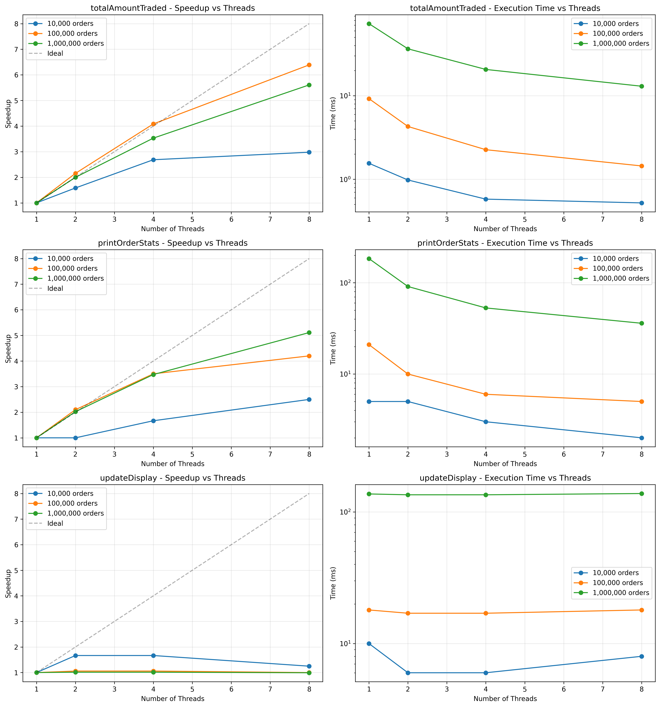
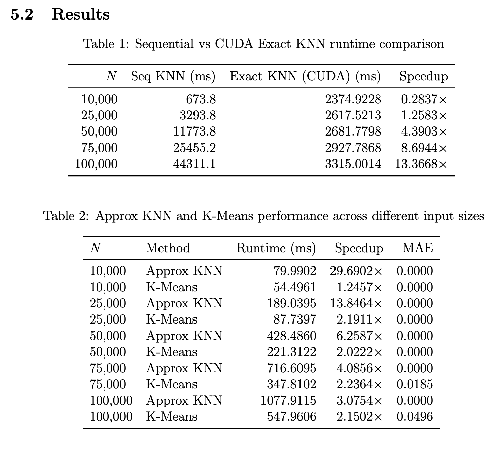
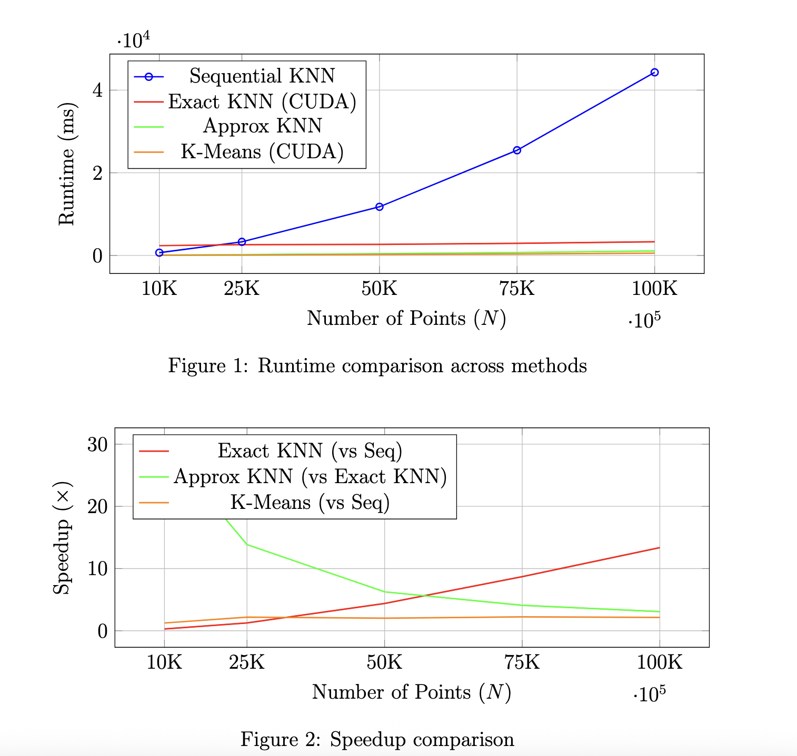

## A1

Benchmark Results

### Performance Summary

Tests conducted on **Apple M4, 10 cores** with varying workload sizes:

| Function | Speedup @ 8 threads |
|----------|---------------------|
| **totalAmountTraded()** | **5.61x** |
| **printOrderStats()** | **5.11x** |
| **updateDisplay()** | **0.99x** |

*Speedup vs. number of threads for the three parallel functions. Dashed line represents ideal linear speedup.*

## A2

Benchmark results

Test Conducted on Tesla K40m GPU (compute capability 3.5, 11 GB
GDDR5) with 8 CPU cores (OpenMP). CUDA 11.0 with GCC 9.1 was used. k = 50,
T = 20.

